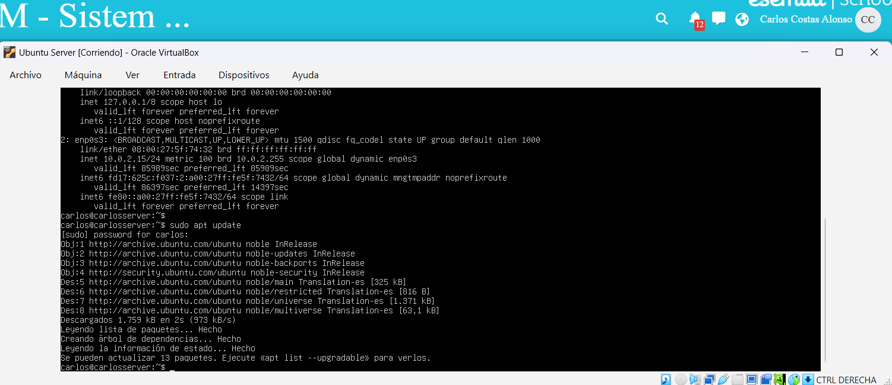
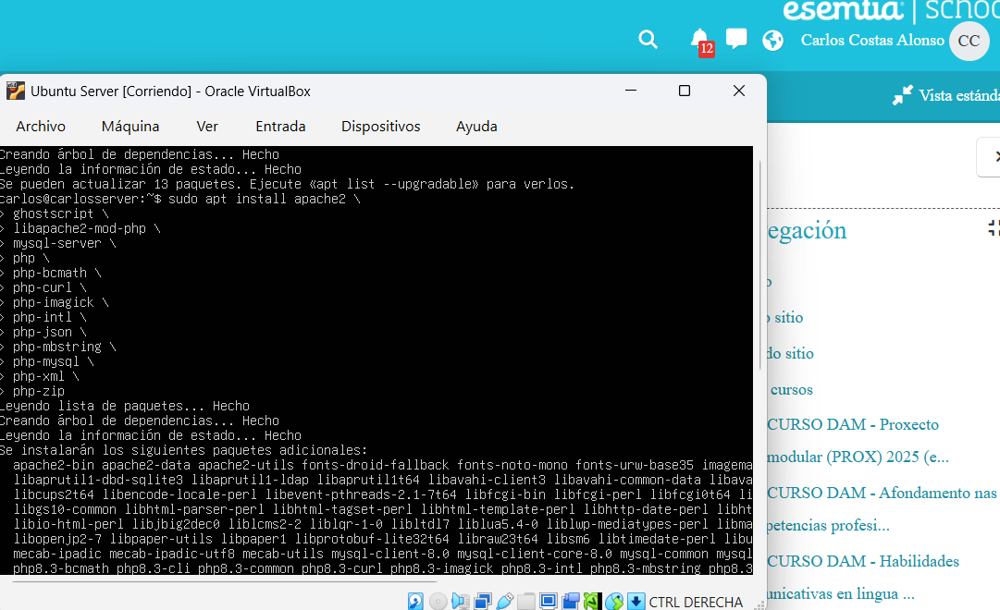
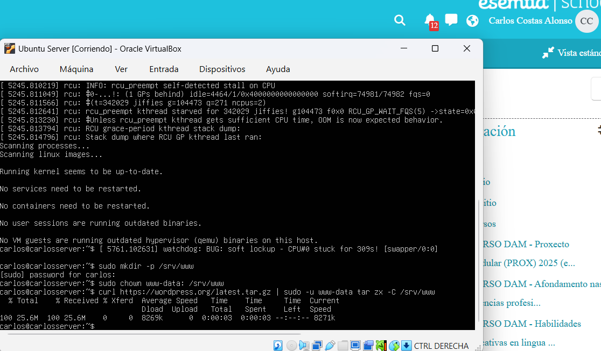
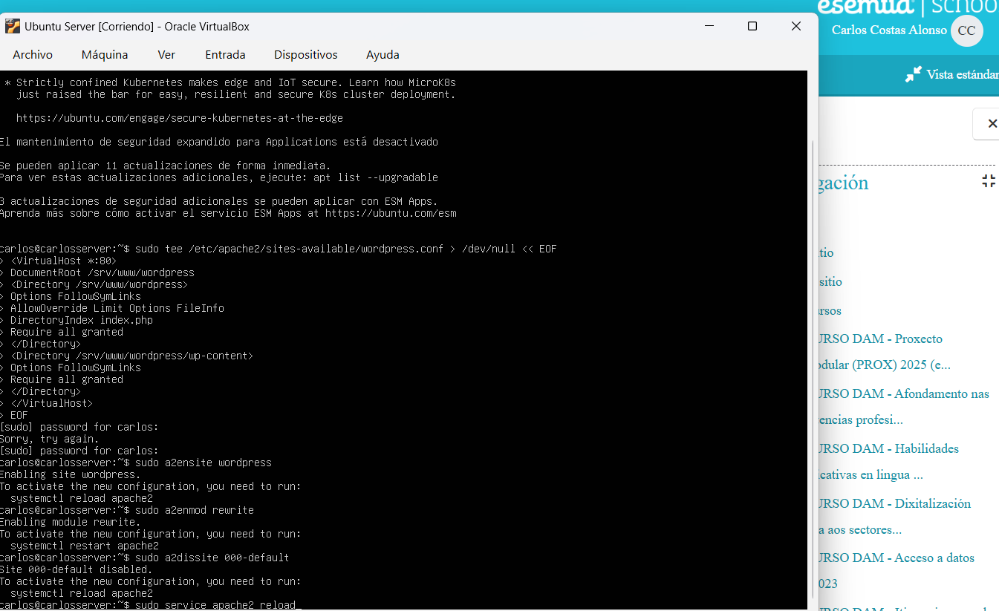
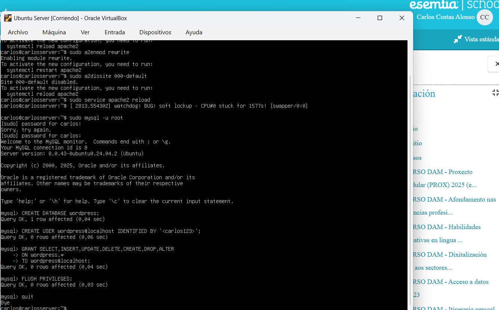
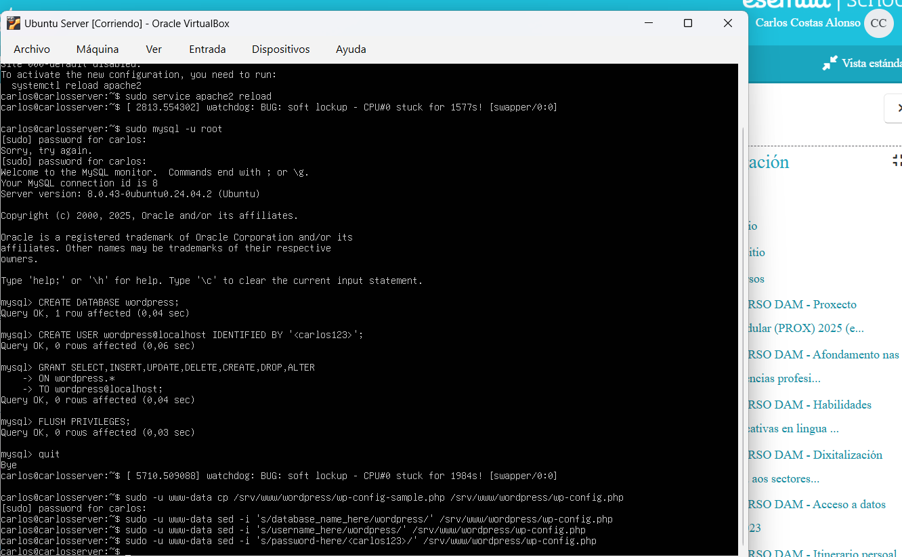
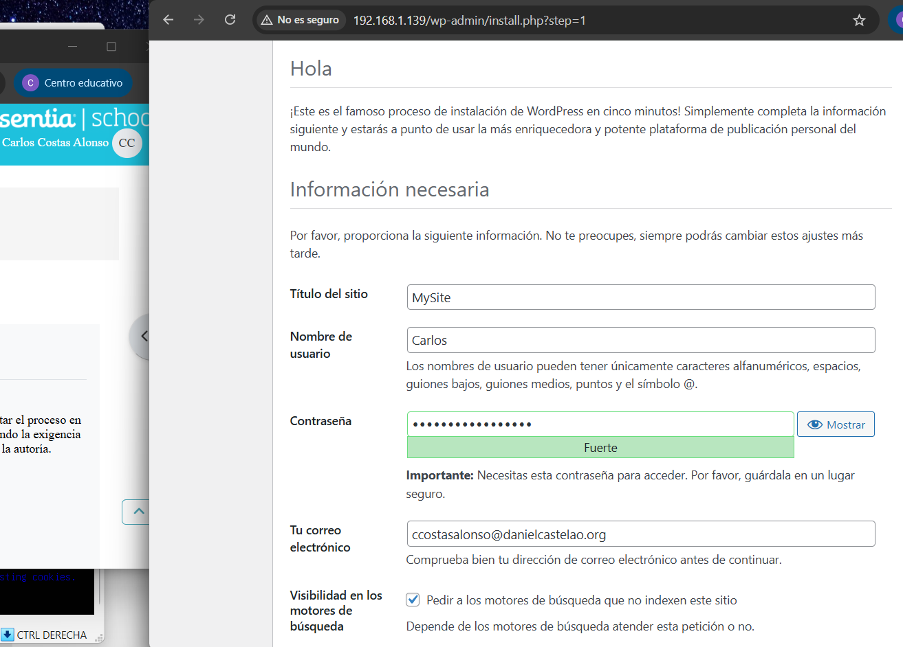
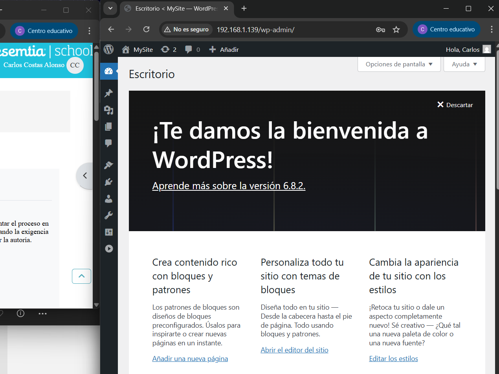

## Instalación de WordPress en Ubuntu Server

Para realizarla he seguido [esta guía](https://ubuntu.com/tutorials/install-and-configure-wordpress).


1. Instalar Ubuntu Server en una máquina virtual


2. Instalar dependencias:

* Actualizamos la lista de paquetes disponibles:
````
sudo nano apt update
````
* Instalamos el servidor web Apache2, un soporte de imágenes y PDF (Ghostscript), un módulo PHP para Apache (que amplía las funciones nativas de PHP, el lenguaje de programación principal de WordPress), la base de datos MySQL y extensiones de PHP que WordPress o plugins puedan requerir (por ejemplo, manipulación de imágenes, operaciones matemáticas arbitrarias, soporte de internacionalización, JSON, manejo de múltiples bytes, conexión con MySQL, XML, compresión ZIP):
````
sudo apt install apache2 \
                 ghostscript \
                 libapache2-mod-php \
                 mysql-server \
                 php \
                 php-bcmath \
                 php-curl \
                 php-imagick \
                 php-intl \
                 php-json \
                 php-mbstring \
                 php-mysql \
                 php-xml \
                 php-zip
````

Ejemplo en Ubuntu Server:






3. Preparar directorio de Wordpress:
* Creamos el directorio srv/www para almacenar archivos de nuestro sitio web servido por Apache:
````
sudo mkdir -p /srv/www
````
* Cambiamos el propietario del directorio al usuario www-data, usado por Apache en muchas instalaciones:
````
sudo chown www-data: /srv/www
````
* Descargamos el archivo comprimido con la versión más reciente de WordPress y lo extraemos en el directorio /srv/www como usuario www-data:
````
curl https://wordpress.org/latest.tar.gz | sudo -u www-data tar zx -C /srv/www
````
Ejemplo en Ubuntu Server:




4. Configurar Apache para WordPress:
* Creamos el siguiente archivo de configuración en /etc/apache2/sites-available/:
````
<VirtualHost *:80>
    DocumentRoot /srv/www/wordpress
    <Directory /srv/www/wordpress>
        Options FollowSymLinks
        AllowOverride Limit Options FileInfo
        DirectoryIndex index.php
        Require all granted
    </Directory>
    <Directory /srv/www/wordpress/wp-content>
        Options FollowSymLinks
        Require all granted
    </Directory>
</VirtualHost>
````
En él, definimos un host virtual que escucha en el puerto 80 (HTTP) y configuramos permisos y directivas para el directorio /srv/www/wordpress.

* Habilitamos el sitio web WordPress:
````
sudo a2ensite wordpress
````
* Habilitamos el módulo rewrite de Apache, que permite transformar URLs de manera flexible:
````
sudo a2enmod rewrite
````
* Deshabilitamos el sitio predeterminado “It Works” (000-default.conf) para que no compita con la configuración:
````
sudo a2dissite 000-default
````
* Recargamos el servicio Apache para que reconozca los nuevos cambios de configuración:
````
sudo service apache2 reload
````
Ejemplo en Ubuntu Server:




5. Configurar la base de datos:

* Creamos una base de datos llamada wordpress.
* Creamos un usuario llamado wordpress que solo se podrá conectar desde el mismo servidor (local host), con una contraseña que elijamos.
* Concedemos permisos para seleccionar, insertar, actualizar, eliminar registros de una tabla, crear, eliminar estructuras y modificar sobre todas las tablas a dicho usuario.
* Recargamos privilegios para que los cambios se apliquen inmediatamente.
* Salimos del cliente de MySQL.
````
CREATE DATABASE wordpress;
CREATE USER wordpress@localhost IDENTIFIED BY '<your-password>';
GRANT SELECT,INSERT,UPDATE,DELETE,CREATE,DROP,ALTER
    ON wordpress.*
    TO wordpress@localhost;
FLUSH PRIVILEGES;
quit
````
Ejemplo en Ubuntu Server:




6. Configurar Wordpress para que se conecte a la base de datos:
* Copiamos el archivo de muestra de configuración wp-config-sample.php que viene incluido con wordpress a wp-config.php, como usuario www-data (que es el propietario del sitio):
````
sudo -u www-data cp /srv/www/wordpress/wp-config-sample.php /srv/www/wordpress/wp-config.php
````
* Usamos sed para reemplazar el texto dentro del archivo (in-place, -i). Reemplazamos database_name_here por wordpress, user_name_here por wordpress y password_here por nuestra contraseña:
````
sudo -u www-data sed -i 's/database_name_here/wordpress/' /srv/www/wordpress/wp-config.php
sudo -u www-data sed -i 's/username_here/wordpress/' /srv/www/wordpress/wp-config.php
sudo -u www-data sed -i 's/password_here/<your-password>/' /srv/www/wordpress/wp-config.php
````
Ejemplo en Ubuntu Server:




7. Configurar WordPress:

* Abrimos en el navegador http://(ip del servidor). 
* Introducimos un nombre para el sitio, nombre de usuario, contraseña y un correo electrónico.
* Ya podemos iniciar sesión en Wordpress y personalizar nuestro sitio.



